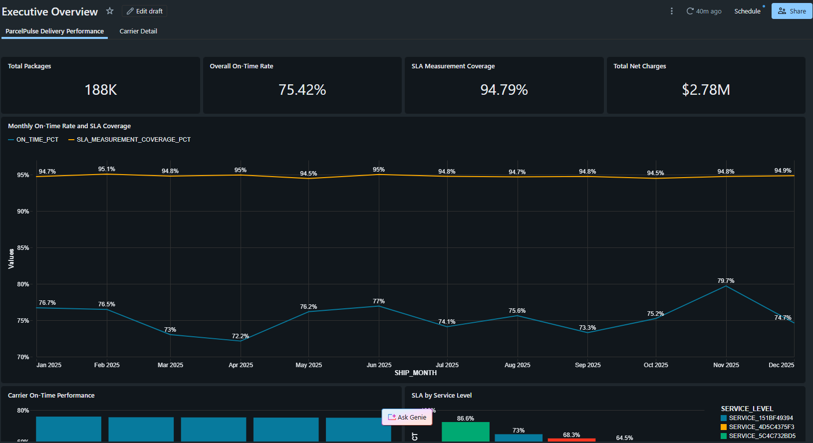
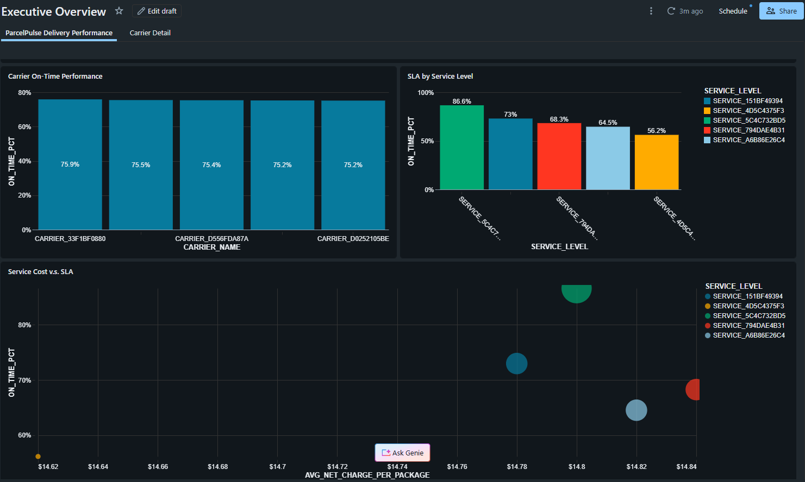
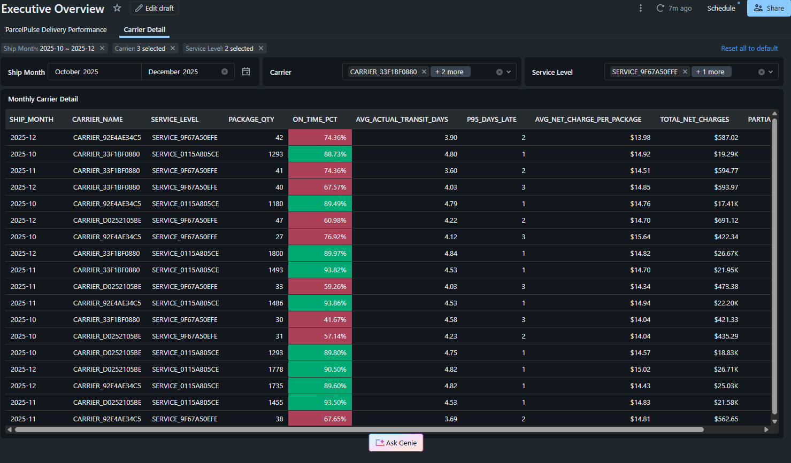
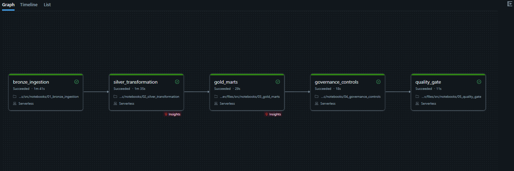
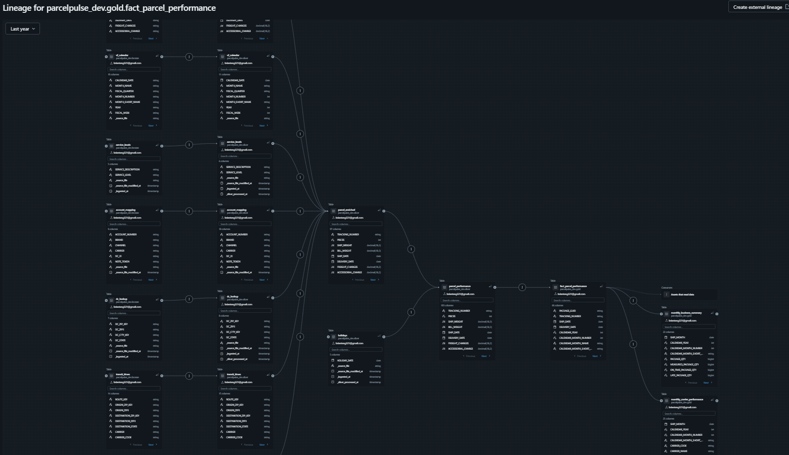

# ParcelPulse

ParcelPulse is an end-to-end Databricks data engineering portfolio project for parcel delivery analytics. It migrates an analyst-oriented pandas workflow into a parameterized lakehouse pipeline with incremental ingestion, deterministic deduplication, governed Gold tables, automated quality gates, and environment-aware deployment.

The cloud demo uses fully synthetic data. Proprietary source records, local anonymization secrets, and generated datasets are not stored in this repository.

## Architecture

```text
11 overlapping TSV windows + 7 lookup files
                     |
                     v
Bronze -- Auto Loader, file metadata, rescued data, Delta snapshots
                     |
                     v
Silver -- safe typing, quarantine, deduplication, reference joins,
          SLA eligibility, holiday-aware business-day calculations
                     |
                     v
Gold   -- parcel fact, monthly business summary, carrier performance
                     |
          +----------+-----------+
          |                      |
          v                      v
Unity Catalog governance    Databricks AI/BI dashboard
column masks + lineage      executive + carrier views
                     |
                     v
Lakeflow Jobs DAG -- quality gate -- DAB dev/test/prod targets
```

## What the project demonstrates

- Incremental file ingestion with Auto Loader `availableNow`, schema tracking, checkpoints, source metadata, and rescued-data monitoring.
- Idempotent handling of overlapping delivery windows using `PACKAGE_GUID` and deterministic source precedence.
- Explicit type validation and quarantine reasons instead of silently dropping malformed rows.
- Seven cleaned reference datasets with key uniqueness and match-coverage checks.
- Correct SLA semantics: missing promises are not counted as on time, and actual transit excludes weekends and configured holidays.
- Delta Gold marts with additive numerator and denominator measures for trustworthy BI aggregation.
- Unity Catalog column masks for carrier name, carrier codes, mapped carrier, and service level.
- A fail-fast quality gate containing 13 reconciliation, uniqueness, completeness, and governance checks.
- A five-task Serverless Lakeflow Jobs DAG deployed through Databricks Declarative Automation Bundles.
- Isolated `dev`, `test`, and `prod` bundle targets mapped to separate Unity Catalog catalogs.

## Synthetic demo results

| Environment | Source windows | Landed rows | Unique parcels | DAB result |
|---|---:|---:|---:|---|
| `dev` | 11 | 452,000 | 250,000 | Five-task DAG succeeded |
| `test` | 2 | 71,000 | 54,000 | Five-task DAG succeeded |
| `prod` | Deployment target defined | - | - | Intentionally not released yet |

The dev dataset has a landing amplification of `1.808x`, intentionally created by overlapping source windows. This makes the deduplication and idempotency behavior observable rather than theoretical.

## Project evidence

All screenshots below use fully synthetic data and anonymized carrier and service identifiers.

### Executive dashboard

The published AI/BI dashboard summarizes parcel volume, on-time performance, SLA measurement coverage, and transportation spend.



### Performance analysis

Carrier performance, service-level SLA attainment, and cost-versus-service trade-offs are presented using reusable Gold-layer metrics.



The carrier-detail view supports month, carrier, and service-level filtering for operational investigation.



### Lakeflow Jobs orchestration

The five-stage Serverless workflow enforces ordered execution from incremental Bronze ingestion through the final quality gate.



### Unity Catalog lineage

Unity Catalog captures the end-to-end dependency graph across reference data, Silver transformations, the parcel fact table, Gold marts, and dashboard consumption.



## Pipeline DAG

```text
bronze_ingestion
      |
silver_transformation
      |
gold_marts
      |
governance_controls
      |
quality_gate
```

Every notebook accepts the same `catalog_name` job parameter. DAB targets supply `parcelpulse_dev`, `parcelpulse_test`, or `parcelpulse_prod`, so the code does not contain environment-specific table names.

## Repository layout

```text
databricks.yml                  Bundle targets and environment variables
resources/parcelpulse_job.yml  Lakeflow Job and task dependencies
src/notebooks/                 Bronze, Silver, Gold, governance, quality gate
```

Local-only source files, lookup inputs, generated outputs, preparation utilities, assessment notes, credentials, CLI binaries, and DAB state are excluded through `.gitignore`.

## Bundle workflow

Authenticate with a local Databricks CLI profile or CI workload identity, then run:

```powershell
databricks bundle validate --target dev
databricks bundle deploy --target dev
databricks bundle run parcelpulse_pipeline --target dev
```

Use `--target test` for the isolated integration dataset. Production is intentionally a separate release decision rather than an automatic consequence of a successful development run.

## Dashboard and governance

The published Databricks AI/BI dashboard contains:

- Executive KPI cards for parcel volume, measured SLA volume, on-time rate, and spend.
- Monthly on-time performance and carrier comparisons.
- SLA performance by service level.
- Service cost versus SLA performance.
- A filterable carrier-detail table.

Sensitive dimensional values are masked through reusable Unity Catalog SQL functions. Governance validation queries `information_schema.column_masks` and requires all seven expected mask bindings before the pipeline can succeed.

## Data safety

The public demonstration dataset is fully synthetic and contains no employer records. Data preparation and anonymization tooling is intentionally kept local. De-identification alone is not treated as permission to publish operational data.

## Migration rationale

The original workflow contained valuable business rules but depended on hard-coded workstation paths, pandas memory, row-wise functions, mutable CSV output, and implicit null behavior. The lakehouse implementation preserves the useful domain logic while adding scalable Spark transformations, Delta transactions, observability, lineage, quality enforcement, and repeatable deployment. The detailed source assessment is intentionally retained only in the local project.

## License

This project is licensed under the [MIT License](LICENSE).
